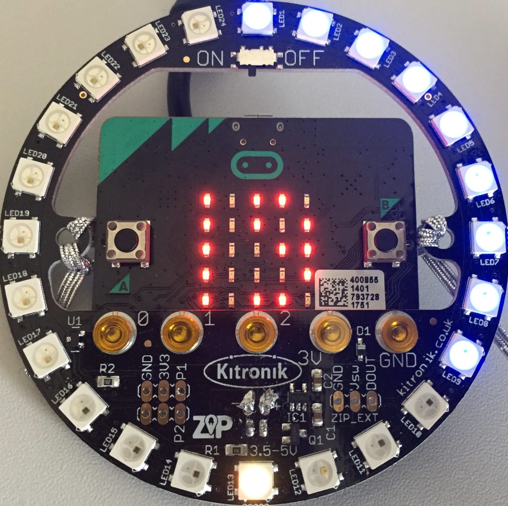

# CONFTIMER

A simple timer using a micro:bit, neopixels and micropython to indicate to help speaker managing her/his imparted time (hence the name, for conference timer), from 1 to 99 minutes.

Conftimer let you set the time you want to count down, and then continuously display how much time is left with some visual cues when the time is almost elapsed. It will keep counting after the defined time.

In the photo below, there is 19 minutes and 30 seconds left on the timer, and 2/3 of the time has elapsed (it was set to 30 minutes).

## Requirements and limitations

This project is intended to run on a [micro:bit](http://microbit.org/) micro-controller, equipped with an array of neopixels. It was developed using a [Kitronik Zip Halo](https://www.kitronik.co.uk/5625-zip-halo-for-the-bbc-microbit.html). If you wish to use a different neopixels array, you should edit the source code to change the number of pixels (N=24) and possibly the pin from which the array will be controlled

## Install

Either drop the hex file to your micro:bit, or use a micropython editor such as the [one from the micro:bit website](http://python.microbit.org/), or [mu](https://codewith.mu/) to modify and upload your modified version.

## How it works

When booting, the timer will let you set the brightness from the neopixels display, from 0 to 10. 0 means the neopixels array will not fill up and will only be used to displays the seconds. Use buttons A and B to increase / decrease the brightness. Press A+B to select the desired brightness level.

Then use buttons A and B to select for how many minutes the timer should run, press A+B to start the timer.

Once the timer runs, the neopixels array will start filling up proportionally to the time elapsed, and the remaining time will be be displayed by a combination of the micro:bit LED array for the minutes, and the neopixels array for the seconds. When there is less than 2 minutes left (or a quarter of the time if the initial time was less than 8 minutes), the neopixels array will start to pulsate to indicate the speaker (s)he needs to wrap up.

One the time is elapsed, both the remaining time and neopixels array will blink.

To reset the time, simply push on A or B, which can be done at anytime while the timer is running.

## Licence (BSD)

Copyright (c), Antoine Mérand
All rights reserved.

Redistribution and use in source and binary forms, with or without modification, are permitted provided that the following conditions are met:

1. Redistributions of source code must retain the above copyright notice, this list of conditions and the following disclaimer.
2. Redistributions in binary form must reproduce the above copyright notice, this list of conditions and the following disclaimer in the documentation and/or other materials provided with the distribution.

THIS SOFTWARE IS PROVIDED BY THE COPYRIGHT HOLDERS AND CONTRIBUTORS "AS IS" AND ANY EXPRESS OR IMPLIED WARRANTIES, INCLUDING, BUT NOT LIMITED TO, THE IMPLIED WARRANTIES OF MERCHANTABILITY AND FITNESS FOR A PARTICULAR PURPOSE ARE DISCLAIMED. IN NO EVENT SHALL THE COPYRIGHT OWNER OR CONTRIBUTORS BE LIABLE FOR ANY DIRECT, INDIRECT, INCIDENTAL, SPECIAL, EXEMPLARY, OR CONSEQUENTIAL DAMAGES (INCLUDING, BUT NOT LIMITED TO, PROCUREMENT OF SUBSTITUTE GOODS OR SERVICES; LOSS OF USE, DATA, OR PROFITS; OR BUSINESS INTERRUPTION) HOWEVER CAUSED AND ON ANY THEORY OF LIABILITY, WHETHER IN CONTRACT, STRICT LIABILITY, OR TORT (INCLUDING NEGLIGENCE OR OTHERWISE) ARISING IN ANY WAY OUT OF THE USE OF THIS SOFTWARE, EVEN IF ADVISED OF THE POSSIBILITY OF SUCH DAMAGE.
